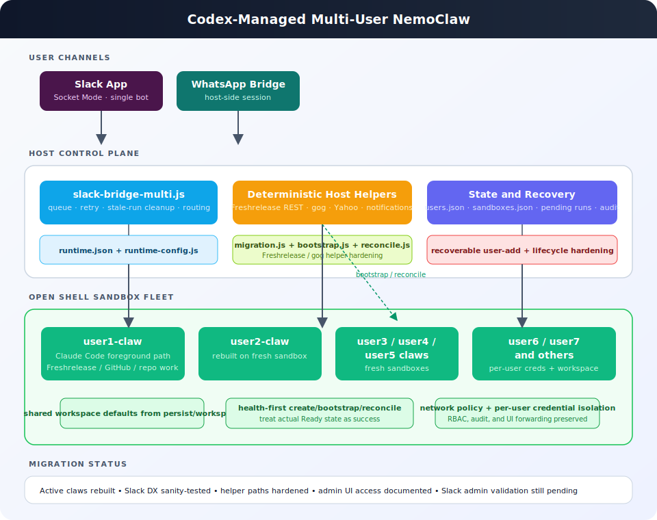

# Multi-User NemoClaw

## Overview

Run multiple always-on assistants — each dedicated to one user — inside isolated OpenShell sandboxes, all managed through Slack and WhatsApp. A central bridge routes messages by user ID, and per-user credential isolation ensures no cross-user data leakage.

**Status:** Production — 8 users across 8 sandboxes on DGX Spark (128 GB RAM).

---

## Architecture

<p align="center">
  
</p>

<details>
<summary>Text version (for terminals)</summary>

```
Slack App (Socket Mode, 1 bot)       WhatsApp (Baileys, 1 session)
    │                                     │
    ▼                                     ▼
slack-bridge-multi.js               whatsapp-bridge-multi.js
    │                                     │
    ├── SSH proxy ─┐                      │
    ├── SSH proxy ─┤   K3s cluster  (namespace: openshell)
    └── SSH proxy ─┤   ┌──────────────────────────────────────────┐
                   │   │  [pod] veyonce-claw    (net policy)     │
                   │   │  [pod] aditya-claw     (net policy)     │
                   │   │  [pod] ...                               │
                   │   │  [pod] nirmal-claw     (net policy)     │
                   │   │  [pod] agent-sandbox-controller          │
                   │   │  [pod] openshell-0 (gateway/dashboard)  │
                   │   └──────────────────────────────────────────┘

Host services:  yahoo-mail.py · watchdog-bridge.sh · forward-slack-to-whatsapp.sh
Automation:     refresh-credentials.sh (15 min) · nemoclaw-resilience.sh --all
Security:       mode 700 credentials · RBAC · K8s network policy · audit log
```
</details>

### Design Decisions

- **One Slack app** with Socket Mode handles all users (no per-user bot tokens)
- **One WhatsApp session** (Baileys) — users register via `!setup whatsapp +number`
- **Per-message routing**: bridge looks up user ID in registry → resolves sandbox
- **Fire-and-poll SSH**: agent launched in background, polled via short SSH calls (survives proxy drops)
- **Per-user message queue**: serializes agent runs per sandbox (OpenClaw lane lock constraint)
- **Orphaned result recovery**: pending runs persisted to disk, delivered on bridge restart
- **Single Node.js process** per bridge regardless of user count

---

## Inference

| Priority | Provider | Model | Where | Used For |
|----------|----------|-------|-------|----------|
| **Primary** | NVIDIA NIM | Llama 3.3 70B Instruct | Gateway (`inference.local`) | All agent reasoning |
| **Claude Code** | Anthropic | Claude Sonnet 4.6 | Direct API | Code migrations, PRs, complex tool use |
| **Fallback 1** | NVIDIA NIM | Llama 3.3 70B | Gateway | Rate limit fallback |
| **Fallback 2** | Ollama | DeepSeek R1 70B | Local (not yet routable from sandbox) | Future fallback |
| **Fallback 3** | Ollama | Qwen3 Coder 30B | Local (not yet routable) | Future fallback |
| **Fallback 4** | Ollama | GPT-oss | Local (not yet routable) | Future fallback |

Rate limit detection triggers automatic fallback: Anthropic → NVIDIA → Ollama chain with 60s cooldown.

---

## Messaging Channels

### Slack (`scripts/slack-bridge-multi.js`)

- Socket Mode, single bot token
- Admin commands: `!show-claws`, `!add-claw`, `!delete-claw`, `!admins`, `!admin-audit`
- Self-service: `!setup help/github/whatsapp/personality/timezone/status`
- Host-side commands: `!yahoo inbox/send/search`, `!wa send`
- Markdown table → Slack native table block conversion
- Clickable links extracted below tables as context blocks
- Debug logging (`[debug:sessionId]`) for troubleshooting

### WhatsApp (`scripts/whatsapp-bridge-multi.js`)

- Baileys (WhatsApp Web) running on host (sandbox proxy blocks WebSocket)
- Two-way: users message the bot's WhatsApp number → routed to their claw → response sent back
- Supports all `!` commands (setup, yahoo, wa, admin, help)
- LID JID resolution for linked device format
- Users register via Slack: `!setup whatsapp +1XXXXXXXXXX`
- Notification forwarding: emoji-prefixed bot responses auto-forwarded to WhatsApp

### Yahoo Mail (`scripts/yahoo-mail.py`)

- Runs on host (IMAP port 993 blocked by sandbox proxy)
- Bridge commands: `!yahoo inbox`, `!yahoo read <id>`, `!yahoo send`, `!yahoo search`
- Cron check every 4 hours with Slack + WhatsApp notification
- Per-user credentials in `persist/users/<id>/credentials/yahoo-creds.env`

---

## Freshrelease Integration

Direct REST API from sandbox (no Claude Code MCP — saves 2 API calls per query):

- **Endpoint**: `https://freshworks.freshrelease.com/{PROJECT_KEY}/issues`
- **Auth**: `Authorization: Token <key>` + `Accept: application/json`
- **User resolution**: `?include=owner,reporter` returns `users` array with `{id, name, email}`
- **API key**: injected into sandbox `.env` as `FRESHRELEASE_API_KEY`
- **Network policy**: `freshworks.yaml` preset with `python3.*` binary glob for httpx support
- **Known projects**: FRESHID, BILLING, SEARCH, EMAIL

---

## User Registry

### `~/.nemoclaw/users.json`

```json
{
  "users": {
    "U0AN4K44ZQB": {
      "slackUserId": "U0AN4K44ZQB",
      "slackDisplayName": "vamsee",
      "sandboxName": "veyonce-claw",
      "githubUser": "lakamsani",
      "enabled": true,
      "timezone": "America/Los_Angeles",
      "roles": ["user", "admin"]
    }
  },
  "defaultUser": "U0AN4K44ZQB",
  "deletedUsers": []
}
```

---

## Per-User Credential Storage

```
persist/users/<slack-user-id>/
  .env                              # User-specific env vars
  credentials/                      # Mode 700
    claude-oauth-token.txt          # Long-lived Teams token
    claude-credentials.json         # OAuth session for claude --print
    claude-settings.json            # Claude Code settings
    gh-hosts.yml                    # GitHub token
    gogcli/                         # Google OAuth (all services)
    freshrelease-api-key.txt        # Freshrelease REST API key
    yahoo-creds.env                 # Yahoo IMAP credentials
    whatsapp-number.txt             # WhatsApp phone number
    whatsapp-auth/                  # Baileys session (if applicable)
  workspace/                        # Personality customization
    SOUL.md / IDENTITY.md / USER.md / TOOLS.md
    HEARTBEAT.md / AGENTS.md / MEMORY.md
```

---

## CLI Commands

```
nemoclaw user-add                         Interactive wizard (or --non-interactive)
nemoclaw user-remove <slack-id>           Remove from registry (keeps sandbox/data)
nemoclaw user-purge --sandbox <name>      Destroy sandbox + registry + persist data
nemoclaw user-list                        List all registered users
nemoclaw user-status <slack-id>           Show user details and sandbox health
nemoclaw user-enable/disable <slack-id>   Enable/disable in bridges
nemoclaw user-grant-admin <slack-id>      Grant admin role
nemoclaw user-revoke-admin <slack-id>     Revoke admin role
```

---

## Automation (Cron)

| Schedule | Script | Purpose |
|----------|--------|---------|
| Every 2 min | `watchdog-bridge.sh` | Restart Slack/WhatsApp bridges if dead, fix root-owned files via kubectl, clean stale session locks |
| Every 15 min | `refresh-all-credentials.sh` | Re-inject all user credentials, restart gateway if config changed |
| Every 2 hours | `backup-all-workspaces.sh` | Backup workspace files from all sandboxes |
| Every 4 hours | `check-yahoo-unread.sh` | Check Yahoo unread, notify via Slack + WhatsApp |
| Every 5 min | `forward-slack-to-whatsapp.sh` | Forward emoji-prefixed Slack bot DMs to WhatsApp |

---

## Security

- **Credential isolation**: Mode 700 per-user directories, no cross-user access
- **SSH tunneling**: Credentials injected via SSH, never committed to git
- **RBAC**: Admin commands restricted by role in user registry
- **Network policies**: Per-sandbox, binary-scoped, protocol-inspected (REST with method/path rules)
- **Inference routing**: NVIDIA NIM via gateway (`inference.local`), agent never sees API keys
- **Rate limit handling**: Auto-detect + 60s cooldown + NVIDIA/Ollama fallback chain
- **Token management**: `.credentials.json` written from long-lived token on every refresh (not deleted)
- **Output filtering**: Internal errors (`[tools]`, `[agent/]`, `PermissionError`, `Traceback`) stripped from user-facing responses
- **Deleted user tracking**: Silent ignores prevent access after removal
- **Audit trail**: Admin actions logged as JSON lines

---

## Capacity (DGX Spark)

| Metric | Value |
|--------|-------|
| RAM per idle sandbox | ~512 MB |
| RAM per active sandbox | ~2 GB |
| Host RAM | 128 GB |
| Comfortable capacity | 50+ sandboxes |
| Current deployment | 8 users / 8 sandboxes |
| Slack bridge | Single Node.js process |
| WhatsApp bridge | Single Node.js process |
| Installed dev tools | JDK 17, Gradle 8.13 (all sandboxes) |

---

## File Reference

| File | Purpose |
|------|---------|
| `bin/nemoclaw.js` | CLI: user-add/remove/purge/list/status/enable/disable/grant/revoke |
| `bin/lib/user-registry.js` | User metadata, lifecycle, deleted-user tracking |
| `bin/lib/registry.js` | Sandbox tracking, atomic locking |
| `bin/lib/credential-setup.js` | `!setup` command handling (github/claude/whatsapp/freshrelease/etc.) |
| `scripts/slack-bridge-multi.js` | Multi-user Slack routing, RBAC, admin commands, table formatting, rate limit fallback |
| `scripts/whatsapp-bridge-multi.js` | Multi-user WhatsApp routing, `!` commands, LID resolution |
| `scripts/whatsapp-bridge.js` | WhatsApp CLI (send/inbox/contacts) for host-side use |
| `scripts/yahoo-mail.py` | Yahoo IMAP/SMTP CLI with HTTP CONNECT proxy support |
| `scripts/inject-user-credentials.sh` | Per-user credential setup (SSH-based) |
| `scripts/refresh-credentials.sh` | Cron: re-inject credentials + gateway health |
| `scripts/nemoclaw-resilience.sh` | Full bring-up (`--all` for all users), JDK/Gradle install |
| `scripts/start-services.sh` | Start Slack + WhatsApp bridges (auto-detect multi-user) |
| `scripts/watchdog-bridge.sh` | Cron: restart bridges, fix ownership, clean locks |
| `scripts/check-yahoo-unread.sh` | Cron: Yahoo unread check + notification |
| `scripts/forward-slack-to-whatsapp.sh` | Cron: forward emoji-prefixed Slack DMs to WhatsApp |
| `scripts/notify.sh` | Shared notification helper (Slack + WhatsApp) |
| `persist/users/<id>/` | Per-user credentials + workspace |
| `persist/audit/admin-actions.log` | Admin action audit trail (JSON lines) |
| `persist/pending-slack-runs.json` | Orphaned run recovery tracker |
